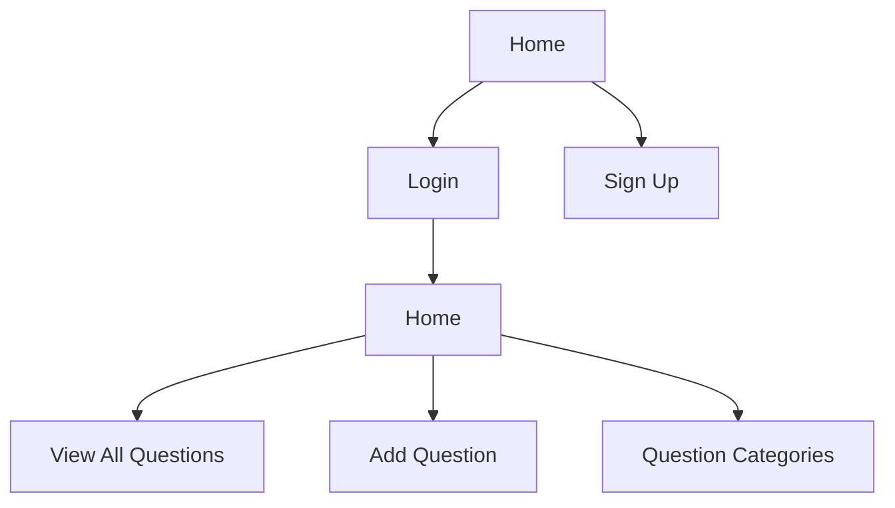

# Development

A simple application that allows you to set-up question and answers in an easy to manage manner.

Organization with an organized `assets` folder and a `components` folder.
If you chose to develop with the router feature, you will also have a `views` folder.

```
project/
├─ assets/ # Contains the assets that are used by the app
├─ src/
│  ├─ main.rs # The entrypoint for the app. It also defines the routes for the app.
│  ├─ components/
│  │  ├─ ...
│  ├─ views/ # The views each route will render in the app.
│  │  ├─ ...
├─ Cargo.toml # The Cargo.toml file defines the dependencies and feature flags for the project
```

### Tailwind

1. Install npm: https://docs.npmjs.com/downloading-and-installing-node-js-and-npm
2. Install the Tailwind CSS CLI: https://tailwindcss.com/docs/installation
3. Run the following command in the root of the project to start the Tailwind CSS compiler:

```bash
npx tailwindcss -i ./input.css -o ./assets/tailwind.css --watch
```

### Serving Your App

Run the following command in the root of your project to start developing with the default platform:

```bash
dx serve --platform web
```

To run for a different platform, use the `--platform platform` flag. E.g.

```bash
dx serve --platform desktop
```

### Sitemap


