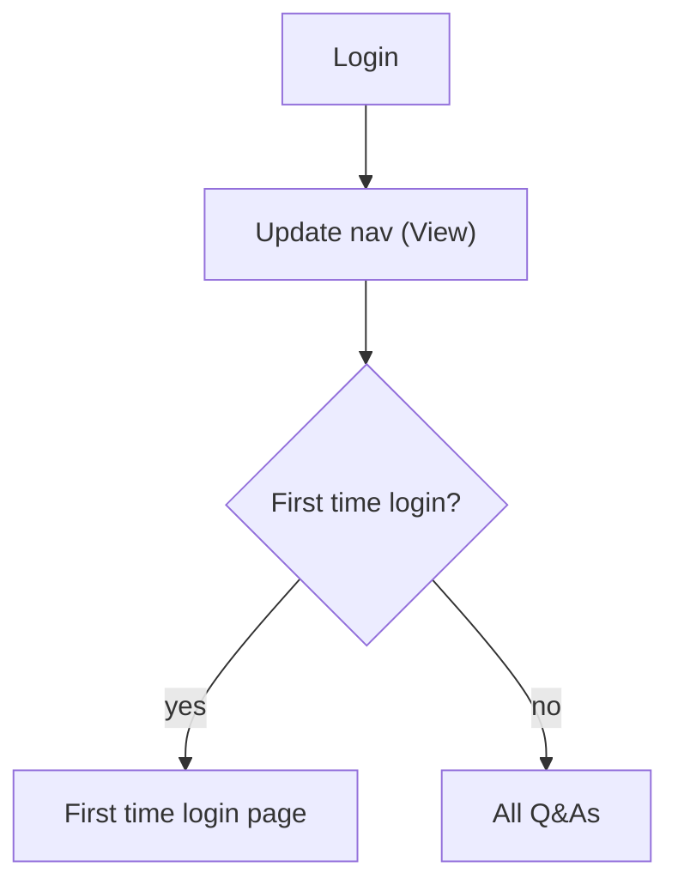
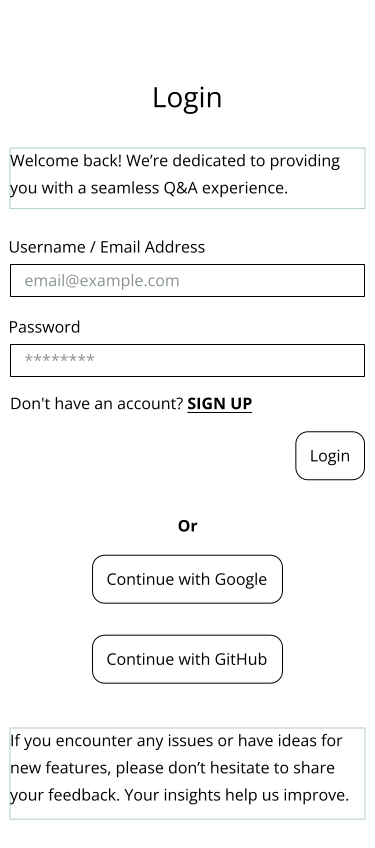

# Login

## Index

-   [Low fidelity design](#low-fidelity-design)

## Page link

-   [Sign Up](../markdown/signup.md)

## Login process

```mermaid
flowchart
    Login[Login]
    click Login "https://github.com/cryarchy/my_qs_and_as/blob/main/markdown/login.md"

    UpdateNav["Update nav (View)"]
    click UpdateNav "https://github.com/cryarchy/my_qs_and_as/blob/main/markdown/sidenav.md"

    DecisionFirstTimeLogin{First time login?}

    FirstTimeLogin[First time login page]
    click FirstTimeLogin "https://github.com/cryarchy/my_qs_and_as/blob/main/markdown/first-time-login.md"

    AllQns[All Q&As]
    click AllQns "https://github.com/cryarchy/my_qs_and_as/blob/main/markdown/all-qas.md"

    Login --> UpdateNav
    UpdateNav --> DecisionFirstTimeLogin
    DecisionFirstTimeLogin --> |yes| FirstTimeLogin
    DecisionFirstTimeLogin --> |no| AllQns
```

## Low fidelity design

