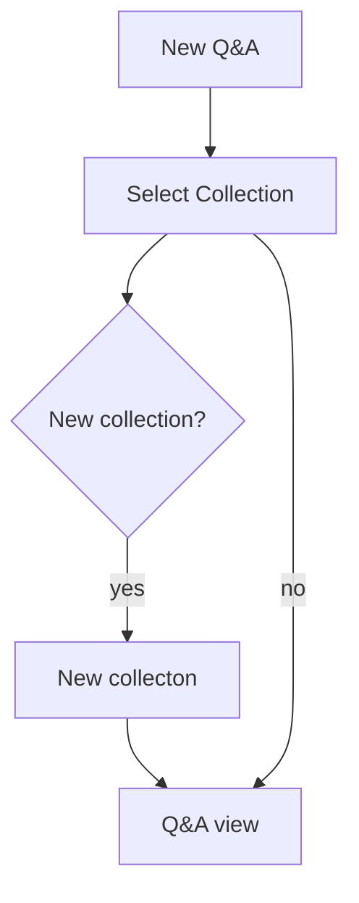

# Sidenav

## Index

-   [Add Q&A process](#add-qa-process)
-   [Low fidelity design](#low-fidelity-design)

## Add Q&A process

```mermaid
flowchart
    NewQA[New Q&A]
    click NewQA "https://github.com/cryarchy/my_qs_and_as/blob/main/markdown/new-qa.md"

    SelectCollection[Select Collection]

    NewCollection{New collection?}

    AddNewCollection[New collecton]
    click AddNewCollection "https://github.com/cryarchy/my_qs_and_as/blob/main/markdown/new-collection.md"

    QAView[Q&A view]
    click QAView "https://github.com/cryarchy/my_qs_and_as/blob/main/markdown/qa-view.md"

    NewQA --> SelectCollection
    SelectCollection --> NewCollection
    NewCollection --> |yes| AddNewCollection
    AddNewCollection --> QAView
    SelectCollection --> |no| QAView


```

## Low fidelity design

