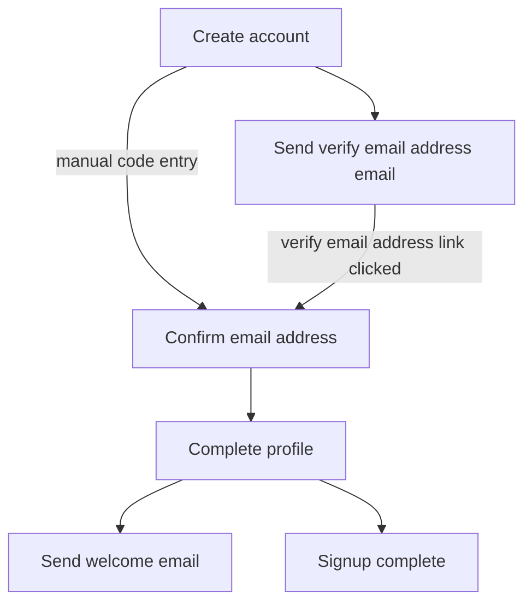
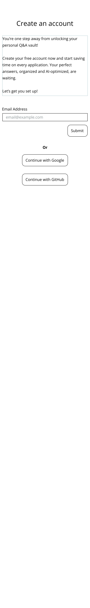

# Signup

## Index

-   [Signup process](#signup-process)
-   [Low fidelity design](#low-fidelity-design)

## Signup process

```mermaid
flowchart
    CreateAccount[Create account]
    click CreateAccount "https://github.com/cryarchy/my_qs_and_as/blob/main/markdown/signup.md"

    ConfirmEmailAddr[Confirm email address]
    click ConfirmEmailAddr "https://github.com/cryarchy/my_qs_and_as/blob/main/markdown/confirm-email-address.md"

    VerifyEmailAddressEmail[Send verify email address email]
    click VerifyEmailAddressEmail "https://github.com/cryarchy/my_qs_and_as/blob/main/markdown/email-verify-email-address.md"

    CompleteProfile[Complete profile]
    click CompleteProfile "https://github.com/cryarchy/my_qs_and_as/blob/main/markdown/complete-profile.md"

    WelcomeEmail[Send welcome email]
    click WelcomeEmail "https://github.com/cryarchy/my_qs_and_as/blob/main/markdown/email-welcome.md"

    SignupComplete[Signup complete]
    click SignupComplete "https://github.com/cryarchy/my_qs_and_as/blob/main/markdown/signup-complete.md"


    CreateAccount --> |manual code entry| ConfirmEmailAddr
    CreateAccount --> VerifyEmailAddressEmail
    VerifyEmailAddressEmail --> |verify email address link clicked| ConfirmEmailAddr
    ConfirmEmailAddr --> CompleteProfile
    CompleteProfile --> WelcomeEmail
    CompleteProfile --> SignupComplete


```

## Low fidelity design

